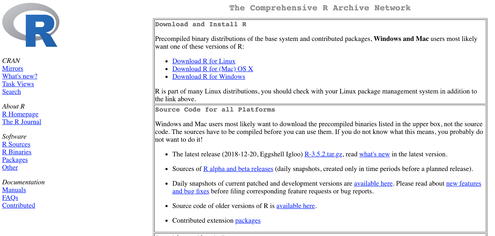
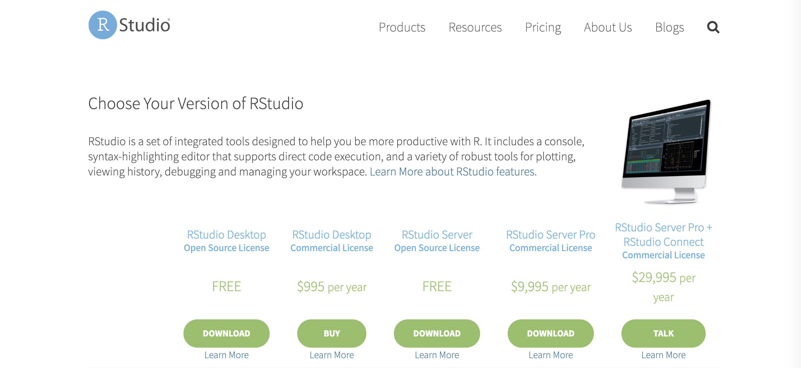
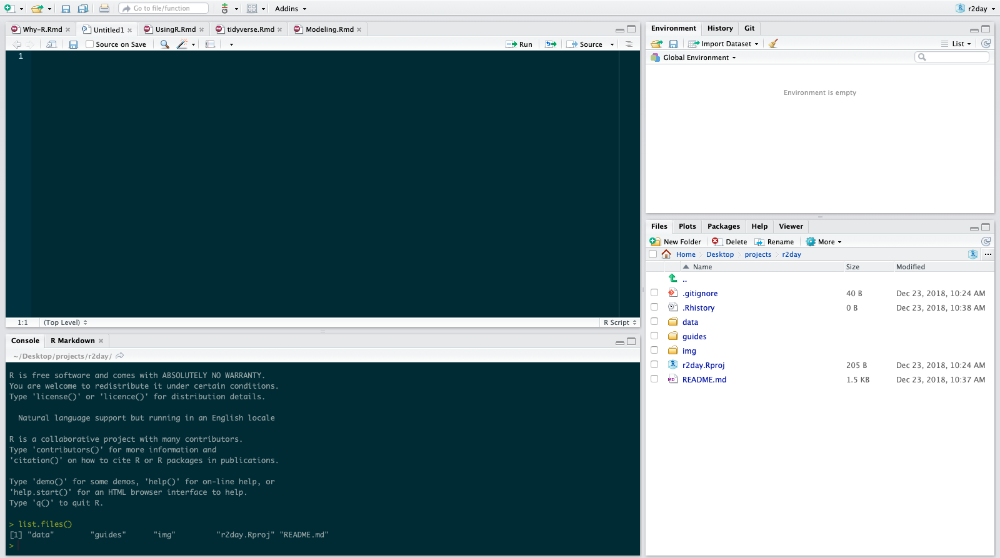
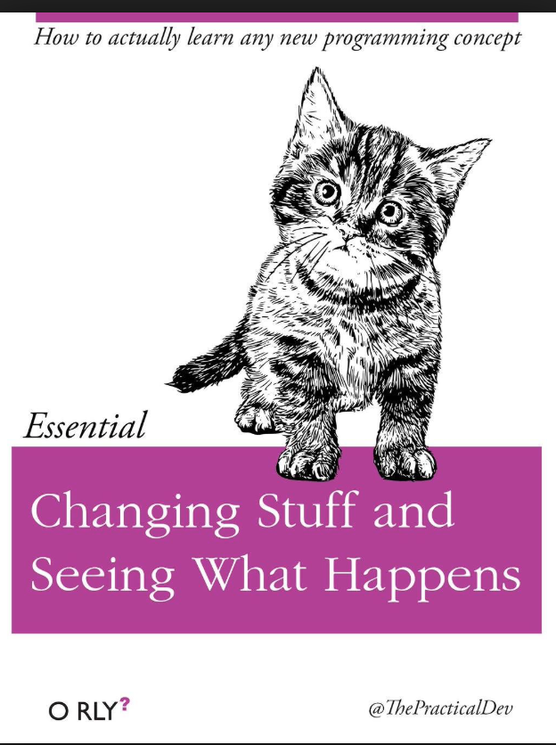

---
title: "Flash R"
author: "David John Baker, Ph.D."
date: "07/20/2019"
output:
  pdf_document: default
  html_document: default
subtitle: Minerva Statistical Consulting
--- 


# Session I (< 45 Minutes)

## Afternoon Goals

* Install R
* Install RStudio
* Run Basic Commands in Console
* Run Basic Tidyverse Commands 
 
## Why R?

1. The R community is fantastic, check out [#rstats](https://twitter.com/search?q=%23rstats&src=typd) on Twitter as well as everyone affiliated with the [tidyVerse](https://www.tidyverse.org/)
2. R will always be free because the people behind it believe in [open source](https://en.wikipedia.org/wiki/Open-source_software) principles.
3. Time spent learning R is time spent learning how computers work. If you learn about R, you are also learning computer programming. Time spent in something like SPSS or SAS does not easily transfer to other programs.
4. On [r-jobs.com](https://www.r-users.com/#open) the way they decide to split jobs is jobs that make above and below $100,000.
5. R is your ticket out of academia, if you need it. It's also insane to think people would learn so much about statistics, the hardest part about becoming a data scientist, without learning the software to get you in the door. 
6. When you make analyses and graphs in R they are very easy to reproduce. You just press 'Run' again.
7. If you do your data cleaning in R, then each step is documented. There is less chance for human error.
8. It makes [gorgeous graphs](http://r-statistics.co/Top50-Ggplot2-Visualizations-MasterList-R-Code.html).
9. There are a lot of ways that R integrates into other software. This book is written in [bookdown](https://bookdown.org/home/), [my website](http://davidjohnbaker.rbind.io/) is written in [blogdown](https://github.com/rstudio/blogdown), you can also make [interactive data applications](https://shiny.rstudio.com/).
10. It's kind of fun. 

## R, RStudio, and Tidyverse

### R

You can download R for your computer by going to [CRAN](https://cran.r-project.org/) and selecting the appropriate ```Download and Install R``` links.
Make sure to install R first before installing RStudio.



### RStudio 

[RStudio](https://www.rstudio.com/products/rstudio/download/) is an integrated development environment (IDE) for R^[https://www.rstudio.com/products/RStudio/].
RStudio is basically your workbench where you can access everything you need for managing your scripts, data, and project structure.
By using RStudio, you also can use a host of other features ranging from Markdown documents (like this one!), interactive data dashboards like [Shiny](https://www.rstudio.com/products/shiny/), and the [tidyverse](https://www.rstudio.com/products/rpackages/).



## RStudio Environment

Once you now have R and RStudio installed, it's time to open up RStudio.
By opening RStudio, you are also starting R.
R will be running under the hood of RStudio.
After installing R, you can run it on it's own by typing ```R``` into your terminal on a Unix machine (Mac, Linux).
Though after seeing how RStudio works, you would realize why doing this is basically masochistic.
(If you do this, you can quit out of the terminal R with ```quit()``` followed by ```n```).

When you first open RStudio will see a few different panels.
In it's default settings, the bottom left is the Console.
The top right has your Environment, History, and version control commands.
The bottom right has your Viewer, Library for your packages, and a system to navigate your files.
The top left will be where you write your code. 



### Environment

The top left has information about your current Environment.
As you make new things in an R session you can track them here.
There is also a History tab here that keeps track of code you wrote.
Additionally there is a Git tab that will eventually allow you to do version control.
You don't have to know what that is, but one day you might read about it.

### Viewer

The bottom right is your File Explorer/Finder window.
Try to click around on the **Files** tab.
When you click **Plots** there should be nothing there as you have not made any plots yet.
Your **Packages** tab will have a listing of software that you can load into R.
Notice that if you click one of the package names, it will navigate you to the **Help** tab.
Lastly, the Viewer tab will let you display any documents that you make while writing in R.
This could be markdown documents or maybe a website that you are writing eventually.

> It is important to note that you will probably "break" R and RStudio many times when learning. Know that this is OK and the some of the best advice for learning how to program is by just seeing what happens when you change something and Googling your problems.

### Console

The Console in R is where you can run one-off R commands.
Try to type a few of to following commands into the Console.

```{R}
list.files()

str(iris)

2 + 2
```

Each of these will create a different kind of output.
Now try to put something in your R console that will create an error message.
Maybe some math that ends with an operation sign?
Maybe some text?
In the next session, we will go over what is legal and illegal input in the R Console.

### Editor

The top left panel is where you edit your documents.
RStudio allows you to handle many different types of documents.
In this course we will mostly use RMarkdown files.
These files end in ```.Rmd``` and allow for both text and R code.
R scripts on the other hand only handle R code.

Using the editor, you should also familiarize yourself with the keyboard shortcuts in RStudio.
For example, to run a line of code in the Editor, you can press ```CMD + ENTER``` on Mac or ```CTRL + ENTER``` on Windows.
When the cursor is on a line that has runable R code, this will run that line in the console.
You can also use your mouse highlight many lines of R code an run the same commands.
We will get a lot of practice with this in the next session. 

# Session 2 - Using R (1 Hour)


## Lesson Goals

* Run Basic Commands in R
* Understand Basic Data Structures
* Run commands over vectors
* Index data frames
* Learn basic data structures
* Understand base R vs Tidyverse
* Import and export data to/from R

## RStudio Shortcuts and Markdown

In this session I will be using a lot of Keyboard Shortcuts when typing myself.
In the past, people have always asked about these, so I'm anticipating that question with a link [here](https://support.rstudio.com/hc/en-us/articles/200711853-Keyboard-Shortcuts) to that page.

## R as Calculator

The Console of R is where all the action happens. 
You can use it just like you would use a calculator. 
Try to do some basic math operations in it.

```{r}
2 + 2
5 - 2
10 / 4
9 * 200
sqrt(81)
10 > 4
2 < -1
```

Now from the output above, you'll notice that there are a few different types of responses that R will give.
For the math responses, we get numbers, but we can also get TRUE and FALSE statements.

When working with data, we need to be aware not only of what the data represents, but what R thinks it represents.
We won't go over the differences between things like ordinal, ratio, and categorical data, I'll assume you have a basic understanding of this.
What we will focus on is the different data types that R thinks in.

For now, we are going to talk about R's basic data structures.

* Logical
* Integer
* Double (numeric)
* Character 
* Factor 

The first is logical. 
Logical is basically just TRUE or FALSE.
We can try a few different expressions that show how this works.

```{r}
2 > 4

1 > 0

4 >= 7

5 != 5
```
Eventually you will learn to take advantage of the complexities of this when we get to subsetting and combining them with other logical operators like ```&```(and) and ```|``` (OR).

Next we have integers and double.
Both integers and double are R's numeric forms of data.
The ```is.numeric()``` command checks for if data is number-y.

```{r}
is.integer(7L)
is.double(7)
is.numeric(7)
```

Next we have characters.
Characters are not *just* letters, but rather data that is text.
Character data is always wrapped in quotes ```" "```

```{r}
is.character("hello, world!")

is.character("7")

is.character("I will drink 7 coffees by the end of today!")

is.character("NA")

```
Note that if a special character like ```NA``` is in quotes, R will still think it is a character.
To change this, we need to coerce our data into a different type.
We will cross that bridge later.
For now, you just need to be aware of the different character types.

Lastly, there are factors which sometimes LOOK like characters, but are R's way of thinking about categorical data.
We need to assign this to R.
When you first import in data into R, it will sometimes guess it as being a factor which is very annoying! 
If R is being slow, or not responding to something you want it to do, a common rookie mistake is to have your data accidentally be a factor.

```{r}

is.factor("doggo")

doggo <- as.factor("doggo")

is.factor(doggo)

is.character(doggo)

is.numeric(doggo)

```

Now that we're at least aware of the different types of data in R, we can move on to building up an intuitive understanding of how R thinks about data under the hood. 

## Being Lazy 

You don't always want to print your output and retype it in. 
The idea of being a good programmer is to be very lazy (efficient).

One of the best ways to be efficient when programming is to save variables to objects.
Below is some example code that uses the ```<-``` operator to assign some math to an object.
After you assign it to an object, you can then manipulate it like you would any other number.
Yes, you can use ``=`` as an assignment operator (for all you Pythonistas), but in R this is considered bad practice as R is primarily a statistical programming language and the ``=`` sign means something very different in a math context.

```{r}
foo <- 2 * 3
foo * 6
```

After running these two lines of code, notice what has popped up in your environment in RStudio!
You should see that you now have any object in the Environment called `foo`.

In addition to saving single values to objects, you can also store a collection of values.
Below we use an example that might have a bit more meaning, the below stores what could be some data into an object that represents what it might be.

```{r}
yearsSellingWidgets <- c(2,1,4,5,6,7,3,2,4,5,3)
```

The way that the line above works is that we use the ```c()``` function (c for combine) to group together a bunch of the same type of data (numbers) into a vector.
Once we have everything combined and stored into an object, we can then manipulate all the numbers in the object just like we did above with a single number.
A single dimensional object is called a **vector**.
For example, we could multiply all the numbers by three. 

```{r}
yearsSellingWidgets * 3
```

Or maybe we realized that our inputs were wrong and we need to shave off two years off of each of the entries.

```{r}
yearsSellingWidgets - 2
```

Or perhaps we want to find out which of our pieces of data (and other data associated with that observation) are less than 2.

```{r}
yearsSellingWidgets < 2
```

Any sort of mathematical operation can be performed on a vector!
In addition to treating it like a mathematical operation, we can also run functions on objects.
By looking at the name of each function and it's output, take a guess at what each of the below functions does.

```{r}
mean(yearsSellingWidgets)
sd(yearsSellingWidgets)
hist(yearsSellingWidgets)
scale(yearsSellingWidgets)
range(yearsSellingWidgets)
min(yearsSellingWidgets)
class(yearsSellingWidgets)
str(yearsSellingWidgets)
summary(yearsSellingWidgets)
```

Often working with data, we don't want to just play with one group of numbers.
Most of the time we are trying to compare different observations in data science.
If we then create two vectors (one of which we have already made!) and then combine them together into a data frame, we have something sort of looking like a spreadsheet.
A two-dimensional object is called a **data frame**.


```{r}
yearsSellingWidgets <- c(2,1,4,5,6,7,3,2,4,5,3)
numberOfSales <- c(5,2,5,7,9,9,2,8,4,7,2)
salesData <- data.frame(yearsSellingWidgets,numberOfSales)
salesData
```

Now if we wanted to use something like R's correlation function we could just pass in the two objects that we have like this and get a correlation value. 

```{r}
cor(yearsSellingWidgets,numberOfSales)
```
But often our data will be saved in data frames and we need to be able to access one of our vectors inside our data frame. 
To access a piece of information in a data frame we use the ```$``` operator.

```{r}
salesData$yearsSellingWidgets
```

Running the above code will print out the vector called ```yearsSellingWidgets``` from the data frame ```salesData```.
Using this form, we can then use this with the correlation function.

```{r}
cor(salesData$yearsSellingWidgets,salesData$numberOfSales)
```

In addition to just getting numeric output, we also want to be able to look at our data.
Take a look at the code below and try to figure out what the function call is, as well as what each argument (or thing you pass to a function) does. 

```{r}
plot(yearsSellingWidgets,numberOfSales, 
     data = salesData, 
     main = "My Plot", 
     xlab = "Years at Company", 
     ylab = "Number of Sales")
```

If you are having a hard time understanding arguments, one thing that might help to think about is that each argument is like a click in a software program like SPSS or Excel.
Imagine you want to make the same plot with this data in SSPSS, what would you do?
The first thing you would do is to go to the top of the bar and find the ```Plot``` function and click it.
This is the same as typing out ```plot()``` in R.
Then you would have to tell that new pop up screen what two variables you want to plot and click on the related variables.
Dragging and dropping those variables into your plot builder is the same as just typing out the variables you want.
Lastly you want to put names on your axes and a title on your plot.
The same logic would follow. 
We'll explore these ideas a bit more in the next section

## Packages and Help

One of best things to do is just open an R help page and play around with things (and break things) until you "get" how it works.



To access R's in built help function you can easier use the Help viewer in R studio or type in a question mark before the command in the console.
Using two ``??`` will search more generally

```{r, eval=FALSE}
?scale()
??scale()
```

## Data Exploration

```{r}
library(tidyverse)
str(txhousing)
class(txhousing)
summary(txhousing)
# View(txhousing)
```

Accessing individual 'columns' is done with the ```$``` operator

```{r, eval=FALSE}
txhousing$sales
```

Can you use this to plot the different numeric values against each other?

What would the follow commands do?

```{r}
hist(scale(iris$Sepal.Length))
iris$Sepal.Length.scale <- scale(iris$Sepal.Length)
```

## Indexing

Let's combine logical indexing with creating new objects.

What do the follow commands do? Why?

```{r}
txhousing[1,1]
txhousing[2,]
txhousing[,5]
txhousing[txhousing$year < 2003,]
txhousing[,c(1:4)]
txhousing[txhousing$city=="San Antonio",c(1:6,8)]
AbilineData <- txhousing[txhousing$city == "Abilene",]
```
This could be an entire lecture by itself!!!
It is important to know how R's indexing works, but in the year 2019 there is no need to be using base R command to index.
We will talk more about the tidyverse tomorrow, but the following code does the exact same indexing as the base R code above, but is much more human readable. 

## Tidyverse

```{r}
txhousing %>%
  filter(year < 2003)

txhousing %>%
  select(city:volume)

txhousing %>%
  select(1:6, inventory) %>%
  filter(city == "San Antonio")

AbilineData <- txhousing %>%
  filter(city == "Abiline")
```

As your code gets longer, the tidyverse becomes more readable.
It is also more helpful for exploring data sets.

## Saving and Importing

Finally, if we want to Import or Save other data, we can do that via the Console.

### The Working Directory

Most of the work we have done this far is data that we do not want to save.
Most of the work you will do after this workshop, you will want to save.

R works by pointing at a folder or directory on your computer.
To see where R is pointing now, run the following code

```{R}
getwd()
```

Whatever you **do** in your R session will happen here unless you tell it to otherwise.
If you do not want R pointing in this location in your computer, you need to set your working directory elsewhere.
To do this, use the ```setwd()``` command.
This is also a good chance to use RStudio's auto complete feature.

```{r, eval=FALSE}
setwd()
```
Open a double quotation in the function then press TAB.
This will allow you to navigate your computer.
Going deeper into your directory structure can be done by just following the auto complete.
Going higher in the directory requires you to type `````` which will allow you to look up a level.
Set your working directory to the ```output``` directory.

The console should now read that it is pointed to the output directory.

You can write a dataset to your working directory with the ```write_csv()``` command.

```{r,eval=FALSE}
write.csv(x = AbilineData, file = "MyData.csv")
```

### Importing Data

Data is imported using the same logic.
You can use the ```read.csv()``` function to read in a csv file.
At first, it might be easier to use the Import Dataset function in RStudio (Top right pane).


# Session 3 - tidyverse (1 Hour)


## Lesson Goals

* Be able to explain tidy data
* Explain the five tidyverse verbs
* Perform basic indexing
* Import and Export data from R 

## tidyverse + tidydata

One of the most important concepts data science and R is the idea of [tidydata](https://cran.r-project.org/web/packages/tidyr/vignettes/tidy-data.html).

The idea behind tidy data is that...

1. Each variable forms a column
2. Each observation forms a row.
3. Each type of observation unit forms a table.

If your data is in this format, then you can do almost anything with the tidyverse.

In order to use the tidyverse, you first need to install it.
```{r}
# install.packages("tidyverse") # Only need to do this once! 
library(tidyverse)
```

## Five Verbs

The five tidyverse verbs come from the dplyr package.
More information on this package can be found [here](https://dplyr.tidyverse.org/) along with these descriptions.

* ```mutate()``` adds new variables that are functions of existing variables
* ```select()``` picks variables based on their names.
* ```filter()``` picks cases based on their values.
* ```summarise()``` reduces multiple values down to a single summary.
* ```arrange()``` changes the ordering of the rows.

We can think the verbs as happening in the logical order you would want to grab them.
Each of the verbs is also going to be connected to one another with the pipe operator.
The idea behind the pipe or ```%>%`` is that the output of the last line is the first argument of the new function.

For example, if we wanted to make a small table that only had data from El Paso from 2011, then only get the first and fifth columns we would run the following code:

```{r}
str(txhousing)
txhousing_only_el_paso <- txhousing[txhousing$city == "El Paso",]
iris_only_only_el_paso_2005_2011 <- txhousing_only_el_paso[txhousing_only_el_paso$year >= 2011,]
iris_only_only_el_paso_2005_2011[,c(1,5)]
```
Which is a bit verbose.

In order to do this with the tidyverse, you would start with the dataset, the run two verbs over it, connected with the pipe.

```{r}
library(tidyverse)
iris_tibble <- as_tibble(iris)

txhousing %>%
  filter(city == "El Paso") %>%
  filter(year >= 2011) %>%
  select(1,5)
```

Both create the same output, but one is much easier to read.

We will now explore a dataset using the five verbs in the dplyr package.
You use each of the five verbs as you would in English to think about how you want to manipulate your data.

They key to using the tidyverse is the %>% operator (the pipe operator).
It works by taking output from what is before it and piping it to the next command.

## Economics Data

The dataset here comes from housing sales data in Texas provided by the TAMU real estate centre.

Variable | Description 
---------|-----------------
city | Name of MLS area
year,month,date |Date
sales | Number of sales
volume | Total value of sales
median | Median sale price
listings | Total active listings
inventory | "Months inventory" : amount of time it would take to sell all current listings at current pace of sales.

### Select

The select command works by "Selecting" the columns you wish to work with.
It can either take the index of the column using numbers, or the text.
There are other options like asking for columns that start or end with certain text.

```{r}
txhousing %>%
  select(1,2)

txhousing %>%
  select(1:3)

txhousing %>%
  select(city, sales:median)

txhousing %>%
  select(starts_with("ci"))

txhousing %>%
  select(-city)
```


### Filter

Once we have the columns we want to work with, we can then pick the rows that are of interest.
We do this with the filter function.
Here when asking for matches of character strings, you need to use the ``==``.
R will remind you if you forget.
The filter command can be combined with the logical operators. 
Remember this includes negation operators. 

```{r}
txhousing %>%
  filter(city == "El Paso")

txhousing %>%
  filter(city == "El Paso" | city == "San Antonio")

txhousing %>%
  filter(city == "El Paso" | city == "San Antonio") %>%
  filter(year >= 2004) 

txhousing %>%
  filter(city == "El Paso" | city == "San Antonio") %>%
  filter(year >= 2004) %>%
  filter(month != 1)
```

### Mutate

The mutate command will create new variables.

```{r}
txhousing %>%
  mutate(zSales = scale(sales))

txhousing %>%
  filter(city == "El Paso" | city == "San Antonio") %>%
  filter(year >= 2004) %>%
  filter(month != 1) %>%
  mutate(zScale = scale(sales))
```


### Arrange

Arrange will sort our data. 

```{r}
txhousing %>%
  filter(city == "El Paso" | city == "San Antonio") %>%
  filter(year >= 2004) %>%
  filter(month != 1) %>%
  mutate(zScale = scale(sales)) %>%
  arrange(sales)

txhousing %>%
  filter(city == "El Paso" | city == "San Antonio") %>%
  filter(year >= 2004) %>%
  filter(month != 1) %>%
  mutate(zScale = scale(sales)) %>%
  arrange(sales, -year)

```


### Group By and  Sumemrise 

Often we also want to perform the same type of calculation on a group in our dataset.
For this we need to group our data, then use the summarize command. 
We can also use the ``n()`` function to count the number of observations in each group.

```{r}
txhousing %>%
  filter(city == "El Paso" | city == "San Antonio") %>%
  filter(year >= 2004) %>%
  group_by(year) %>%
  summarise(mean = mean(sales))
  

txhousing %>%
  filter(city == "El Paso" | city == "San Antonio") %>%
  filter(year >= 2004) %>%
  group_by(year) %>%
  summarise(mean = mean(sales), n = n())
```

### Work Time

We will now explore the dataset using some guided questions.

In a new script, create following:

* Create a table with only the the first four counties in the dataset.
* Next, run the same command and run that only using one argument that adds in counties that have the work "County" in the title
* Create any new table using a single logical operator
* Create a table with a two logical operators
* Create a table that has no observations from either Paris or Waco.
* Create a new variable based on two other variables 
* Find the month with the highest average scales in Tyler county for the year 2015
* Create a table with data from Austin and Galveston, using only the last three years of the dataset. Group the sales by county and then calculate z scores for each county. 
* Save your new table to a csv file


